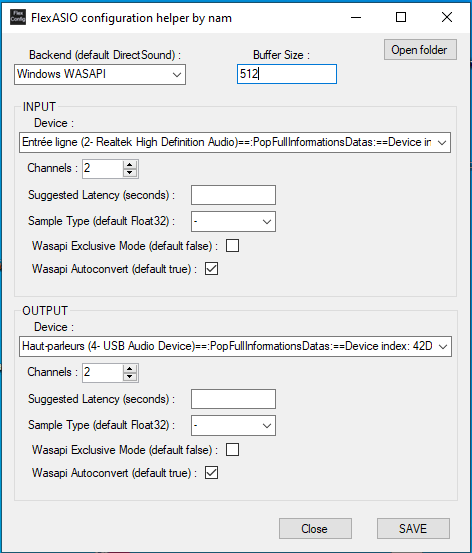

# FlexASIO_ConfigGUI
Simply a Graphical Interface to help in creating the FlexASIO.toml configuration file.

This uses tommy toml. A one file TOML parser. https://github.com/dezhidki/Tommy

This also contains 4 files taken straight from FlexASIO project. (to list devices. Yes i am lazy.) https://github.com/dechamps/FlexASIO

